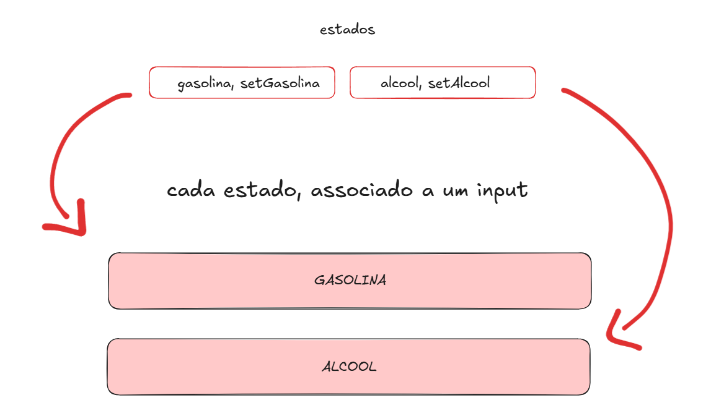
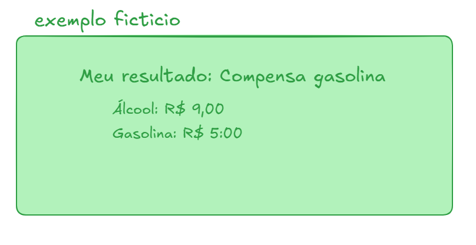
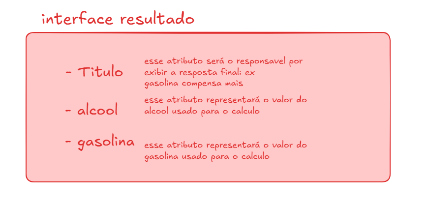

# Documentação Oficial do Desafio

## Projeto: Calculadora de Combustível

### Objetivo
Indicar para o usuário, a partir da cotação, qual das alternativas entre gasolina ou álcool irá compensar mais.

## Etapa 01 - Parte Estrutural (HTML)

### Como será nosso Layout?

- Inputs
- Botão
- Formulário

### Parte Funcional
Irá pegar os valores que o usuário digitar, realizar o cálculo estabelecido na regra de negócio e, a partir disso, apresentar o resultado ao usuário.

### Configuração
- Configuração do CSS global no arquivo `index.css` do projeto.

Após a criação de toda a estrutura e a personalização visual, damos início à adição das funcionalidades do projeto.

## Etapa 02 - Parte Funcional

### Captura de valores do formulário
- Pegamos os valores digitados pelo usuário, localizados nos inputs do formulário, e a partir disso executamos uma ação com o auxílio do Hook `useState`.
- Criamos os estados para armazenar os valores dos dois campos necessários para executar o cálculo.

**Exemplo:**


- Como estamos usando formulários, é uma boa prática chamar a função de cálculo através da propriedade `onSubmit={nomeFunção}` do formulário.

### Cancelamento do reload da página
- O formulário, por padrão, possui o comportamento de recarregar a página automaticamente, limpando os campos e prejudicando a experiência de uso de SPA's (Single Page Applications), que evitam esse recarregamento.
- Para cancelar esse comportamento, passamos o parâmetro `event` na função chamada pelo formulário.
- O TypeScript, por padrão, exige uma tipagem para esse `event`, já que ele não a reconhece automaticamente.
- Resolvemos isso importando e adicionando a tipagem do próprio **React**: `:FormEvent`.
- Dentro do escopo da função, usamos o método `preventDefault()` para prevenir o comportamento padrão do evento: `event.preventDefault()`.

### Lógica de Cálculo
- Criamos a lógica da função aplicando a fórmula `álcool / gasolina`.
- Caso o resultado seja maior que **0.7**, a gasolina é mais viável; caso contrário, o álcool é a melhor escolha.
- Conectamos os inputs aos estados criados anteriormente.

### Observação sobre tipos no TypeScript
- Ao declarar o atributo `onChange` nas propriedades do input para mudar o estado conforme o valor digitado, pode ocorrer um erro no TypeScript, já que ele espera uma string, mesmo que o input seja do tipo `number`.
- Para resolver, usamos a função `Number()` do JavaScript para converter o valor digitado em número.

**Exemplo:**
```javascript
onChange={(e) => setAlcool(Number(e.target.value))}
```

Assim, o valor digitado no input é convertido para número e atualizado no estado.

## Etapa 03 - Resultado

### Criação do componente de resultado
- Essa etapa documenta a criação do componente responsável por exibir as informações geradas pela nossa função.
- O comportamento esperado é exibir o resultado assim que o usuário preencher os campos e clicar no botão; antes disso, o componente deve permanecer invisível.

**Exemplo:**


### Lógica da tela de resultado
- Criamos um novo estado para armazenar o resultado.
- Por questões de manutenção e aprendizado de TypeScript, criamos uma interface para definir as propriedades do componente de resultado.

**Exemplo da interface:**


- Dentro da estrutura condicional da regra de negócio, setamos o estado do resultado conforme a condição.

**Exemplo:**


- Os atributos do objeto de resultado são baseados nos valores passados aos estados.
- Passamos esse objeto para que a seção de resultado consuma seus valores.

## Renderização Condicional
- Consiste em exibir o resultado apenas quando o usuário preencher os campos e clicar no botão.

### Como fazer isso?
```javascript
info && Object.keys(info).length > 0 && (resultado a ser renderizado)
```

**Explicação:**
- `Object.keys(info)` retorna um array com todas as chaves do objeto `info`.
- `.length` informa a quantidade de elementos no array.
- Verificamos se `info` tem propriedades (ou seja, se não está vazio).
- `info &&` impede erros caso `info` seja `undefined`.
- O operador `&&` indica que há mais condições a serem verificadas.

Assim, o resultado só é exibido se o objeto `info` tiver propriedades e não for `undefined`.

## Polimento
- Ajustamos os valores dos combustíveis para assumirem o formato monetário brasileiro (BRL).
- Criamos a função `formatarMoeda()`.

**Exemplo final:**


**Explicação:**
Essa função recebe um número (`valor`) e o transforma no formato de moeda brasileira (R$).

- `valor.toLocaleString("pt-br")`: Formata o número no padrão brasileiro.
- `style: "currency"`: Define o formato como moeda.
- `currency: "BRL"`: Define o real brasileiro como a moeda.

## O que Aprendi
- Hook `useState`
- Comportamento padrão de formulários e como cancelá-lo
- Renderização condicional de componentes
- Tipagem de eventos com `FormEvent` no TypeScript
- Conversão de valores de input para `Number`
- Formatação de valores monetários com `toLocaleString()`

